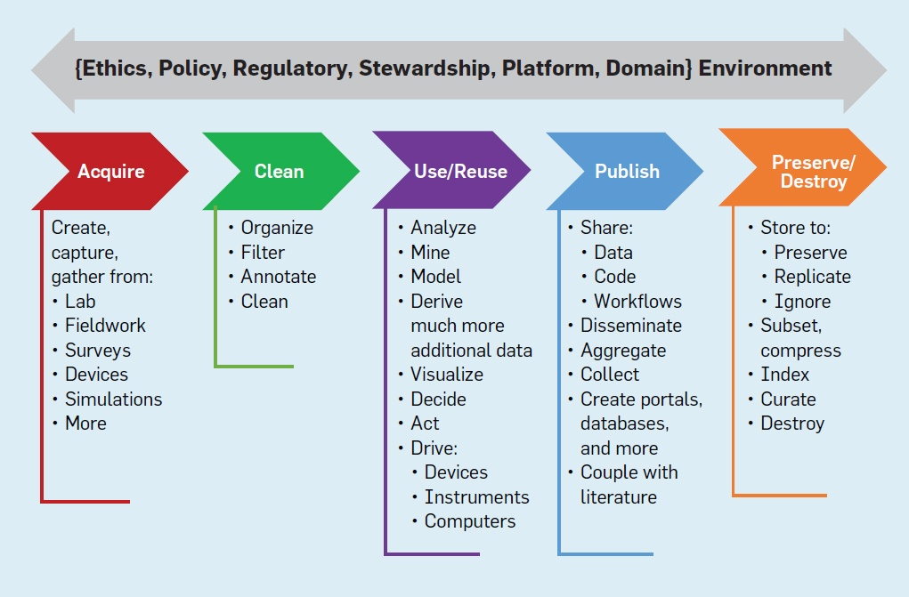

# UCLA Library Data Science Center

The Data Science Center's mission is to foster a welcoming research community by developing data literacy and foundational coding skills through consulting and education. We support researchers throughout the full data life cycle of activities: planning research projects and data management plans; data acquisition, storage, cleaning, and usage; analysis; publication; curation; and preservation. 

We:

Provide support for the full data science lifecycle
Build data science infrastructure that promotes sharing, data use and lifecycle management
Provide support for computational reproducibility and discovery
Contribute to data science instructional and curricula support
Provide support and referrals for researchers needing to work at scale (beyond the laptop)
A good sense of the activities we aspire to support can be gleaned from this data lifecycle:

